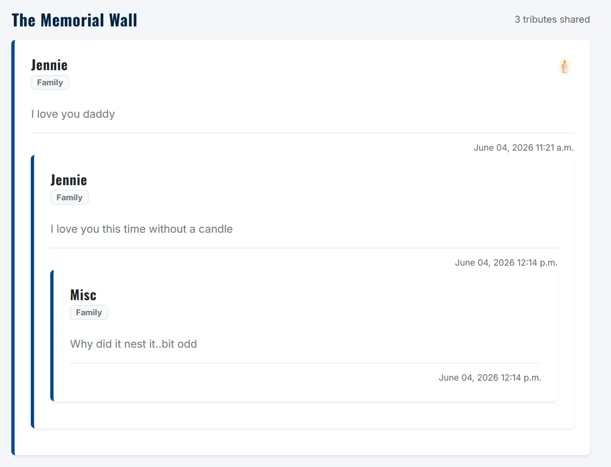
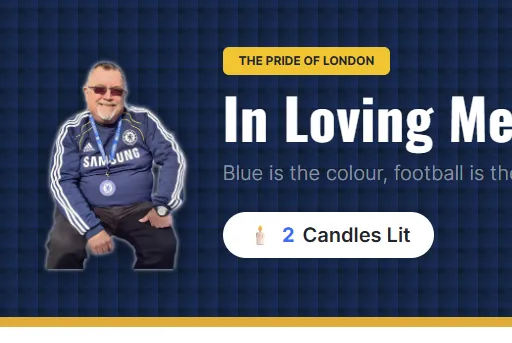
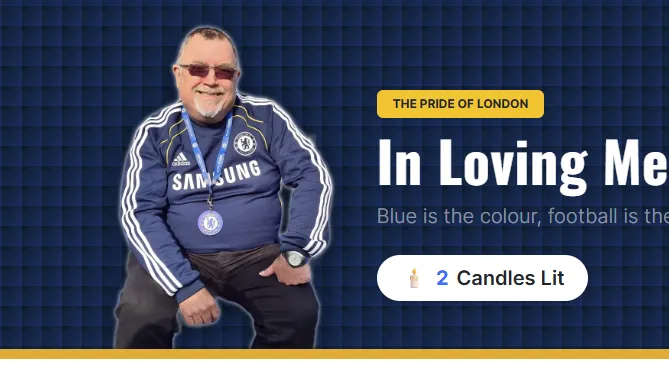
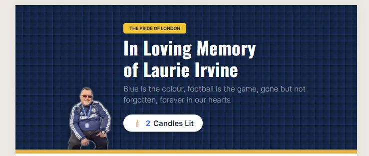
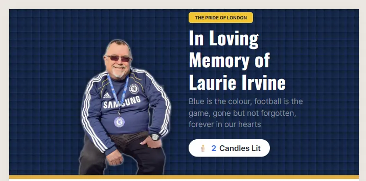

# Milestone 3: Virtual Memorial and Tribute Space

<figure>
    
</figure>


## In Loving Memory - Virtual Memorial & Tribute Space

### Project Overview & Context

This web application has been developed for Milestone 3 of the Code Institute Level 5 Diploma in Web Application Development. The brief was to develop and implement a responsve, full-stack, database-back web application using Python, Django framework and a relational database. 

I have created a private virtual memorial and tribute space dedicated to the memory of my late father. It provides an interface where family, friends and community can easily read a shared timeline of condolences, submit their own text-based tributes and light a virtual candle.


You can view the deployed application here [Where in the Whoniverse?](https://....)


---

## CONTENTS

* [User Experience](#user-experience-ux)
  * [User Stories](#user-stories)

* [Design](#design)
  * [Colour Scheme](#colour-scheme)
  * [Typography](#typography)
  * [Imagery](#imagery)
  * [Wireframes](#wireframes)

* [Features](#features)
  * [General Features on Each Page](#general-features-on-each-page)
  * [Future Implementations](#future-implementations)
  * [Accessibility](#accessibility)

* [Technologies Used](#technologies-used)
  * [Languages Used](#languages-used)
  * [Frameworks, Libraries & Programs Used](#frameworks-libraries--programs-used)

* [Deployment & Local Development](#deployment--local-development)
  * [Deployment](#deployment)
  * [Local Development](#local-development)
    * [How to Fork](#how-to-fork)
    * [How to Clone](#how-to-clone)

* [Testing](#testing)
  * [Solved Bugs](#solved-bugs)
  * [Known Bugs](#known-bugs)


* [Credits](#credits)
  * [Code Used](#code-used)
  * [Content](#content)
  * [Media](#media)
  * [Acknowledgments](#acknowledgments)

---

## User Experience (UX)

### Target Audience
Family members, friends, neighbours, colleagues wishing to share condolences and memories or light a virtual candle.

### User Stories

#### First Time Visitor goals
* As a First Time Visitor, I want to see a clean timeline of tributes and memories left by others without having to navigate a complicated website layout.

* As a First Time Visitor, I want to easily find and fill out a simple guestbook form with my name, relationship and a personal memory without being forced to create an account.

* As a First Time Visitor, I want to light a virtual candle alongside my message so that I can show my support


#### Returning Visitor goals
* As a Returning Visitor, I want to revisit the page and see an updated total counter of how many virtual candles have been lit, so that I can see the ongoing support from friends and family over time.

* As a Returning Visitor, I want to search for a specific tribute by a particular person, or a keyword so that I can read the story and share others memories.

* As a Returning Visitor, who has already left a memory, I want to ensure that nobody else can accidentally edit or delete it from the front end. 

## Design


### Colour Scheme

Because this project is based on Doctor Who I wanted to incorporate the colour palette of Doctor Who without completely copywriting the branding and trademark. 
<br>


<br>
<br>
<br>
<br>
<br>
<br>
<br>
<br>
<br>
<br>
I used [coolors](https://coolors.co/) to create my colour palette.
These colours have been used in the following way:
* I have used `#063970` as the text colour, the button background.
* I have used `#FFD700` as an accent colour. It is used as a Hover effect on the buttons and to emphasise the 'Whoniverse' in the title. 
* I have used `#F4F4F9` as the background. I chose this off white colour as it is less harsh on the eye compared to using `#FFF`
* I have used `#000` for the borders on the project

For this project I used CSS styles for colours throughout the project. Instead of hard-coding hex codes in the various styles I declared the colour palette as global variables in the `root:` selector. This made sense for many reasons, primarily because the colours need only be declared once. Any follow up changes or tweaks to colours can be made in one place and updated throughout.

By using `var` to insert the value of a variable it also means I can give them semantic meaning. So instead of a variety of different Hex code, I instead have `var(--accent-colour)` which is brilliant for readability throughout.  

Initially I was going to implement a dark/light mode toggle and whilst this is now moved to a future development, by using the variables it would be easy to swap the values under a different class rather than write additional CSS to accommodate the different light/dark mode colours.  

### Typography

I used [Google Fonts](https://fonts.google.com/) for this project. 

* For headings / titles I used <strong>Orbitron</strong>. I chose this font because it's a sans-serif font with a futuristic look. In the same way as the colours, I didn't want any copyright / trademark infringement so steered away from fan fonts. 

  
  <hr>
  <br>
* For the main text, I wanted to include a sans serif font for readability. I also wanted it to have a slightly futuristic look and so I used <strong>Roboto</strong>. 

   


### Imagery

* Logo - For the logo, I wanted to merge together the idea of the TARDIS and a standard Map Pin. I wanted to keep it nice and simple, so the focus is on the game, rather than the logo. 
   
<br>
<br>
<br>
<br>
<br>
<br>

* Locations - For the locations, I wanted to find still images from iconic locations in Doctor Who to use as a visual clue for the player. 

* 404 Page - For the 404,  I have always liked a funny picture on a 404 page. I liked the idea of a broken down TARDIS or something like that as a visual clue to the user that something has gone wrong. 

### Wireframes
Wireframes were created using [Canva](https://www.canva.com)

#### ON PAGE LOAD

#### Desktop
<figure>
    
    <figcaption>This shows how the app will load on desktop with two clear buttons "Start Game" and "How to Play"</figcaption>
</figure>


#### Mobile
<figure>
    
    <figcaption>This shows how the app will load on mobile using vertical stacking with two clear buttons "Start Game" and "How to Play"</figcaption>
</figure>


#### PLAYING THE GAME

#### Desktop
<figure>
    
    <figcaption>This shows how the app will appear in 'play' mode, with the map on the left and all buttons/scoring on the right"</figcaption>
</figure>

#### Mobile
<figure>
    
    <figcaption>This shows how the app will appear in 'play' mode" keeping the map on the top of the stack and keeping buttons 'thumb friendly' for users on mobile.</figcaption>
</figure>


#### RESULTS DISPLAY
#### Desktop
<figure>
    
    <figcaption>This shows how the app will appear in 'results' mode, keeping consistent, with the map on the left and all buttons/scoring on the right"</figcaption>
</figure>

#### Mobile
<figure>
    
    <figcaption>This shows how the app will appear in 'results' mode" keeping the map on the top of the stack and keeping buttons 'thumb friendly' for users on mobile.</figcaption>
</figure>


## Features
Where in the Whoniverse comprises the following pages:
* index.html - Allowing the user to start the game, or learn how to play
* game.html - The game itself 
* 404.html - If the user requests a webpage that cannot be found, with a redirect to the homepage. 

### General features on each page

Each page has the following consistent features:

#### Favicon
Each page has a a favicon version of the TARDIS pin logo. This gives the website a professional look and reinforces the brand. 

#### index.html

#### Logo / Header
Each page has a consistent header section containing the TARDIS pin logo and a stylised header with the name of the game <strong>Where in the Whoniverse?</strong>. The logo and the header both provide a link back to the homepage.
<br>


#### Footer
Each page has a simple but consistent footer which contains copyright information and a disclaimer that the website is not affiliated with BBC or Doctor Who. 


### Index.html
The index / home page features the header, an image I created featuring a world map, a pin marker and a TARDIS followed by two clear buttons "Start Adventure" and "How to Play". The aim was to keep it simple, so users could quickly understand what to do. 
<br>
<br>

<br>

* Start Adventure - Clicking the Start Adventure button will take the user to the game.html page. 
* How to Play - Clicking the How To Play button will open up the modal which explains how to play the game. 


### Game.html
The game page displays the following components:
* The left hand grid (Taking up 2/3rds) - Map - which will always default to Bad Wolf Studios in Cardiff
* The right hand grid (Taking up 1/3rd) 
  * The location image - A randomised choice of 10 location images
  * A score box which updates each round
  * A round X of X box which updats each round
  * A hint button which will provide a modal pop up with a hint to solve the location. 
<br>
<br>


<br>

#### The Map 
<figure>
    
    <figcaption>This shows the TARDIS marker pin being placed at a location on the map</figcaption>
</figure>
To enhance the game immersion, I replaced the default Leaflet marker with a custom TARDIS-pin SVG. I adjusted the iconAnchor properties to ensure the 'landing' point of the TARDIS correctly aligns with the user's geographic coordinates.
<br>
<br>


#### The Hint Modal
The hint button takes the hint text from locations.json to display a line of text which will give the user additional help to find the location.
<figure>
    
    <figcaption>The hint modal will pop up on click and give the user extra help to find the location</figcaption>
</figure>
<br>
<br>


#### The Submit Button
The submit button has a built in check to ensure the user doesn't accidentally click submit before adding a marker on the map. If the user does submit before adding a marker the following modal will activate. 
<figure>
    
    <figcaption>The error modal pop up if a user submits before adding a marker</figcaption>
</figure>
<br>
<br>
When a user clicks the submit button after placing a pin marker. A calculation based on the leaflet.js built in functionality will work out the distance between where they clicked and the co-ordinates provided in the locations.json file. It will then calculate a score and present these to the user, with an option to progress to the next round. 
<figure>
    
    <figcaption>The submit modal will provide feedback to the user on where the location is, how far away they were from it and how many points they are going to get.</figcaption>
</figure>

<figure>
    
    <figcaption>Once a player has completed 5 rounds they get a modal with their final score and the chocies to Play Again? or Exit to Menu</figcaption>
</figure>

#### 404.html
The 404 page acts as a seamless user experience, if a user were to navigate to a non existent URL instead of seeing a standard browswer error they will instead see a themed 404 page with a button navigating back to the index.html page. I implemented a CSS on hover effect with the TARDIS image just for "fun". I was thinking along the lines of the dinosaur game you get on browswers. Just a small bit of entertainment for the user.


### Future Implementations

* I initially wanted to build the project with a light/dark mode toggle. As part of my research into this, I stumbled across using global variables for the colour scheme, which I have kept. I soon found myself getting sidetracked and spending a lot of time on the toggle and couldn't quite get it right, so decided to shelf it for this project and add it as a future development.


### Accessibility

Throughout this project I have aspired to make it as accessible as possible. 
#### Design
I deliberately chose a clean, high-contrast design throughout the project. The off white background colour is easier on the eye to the viewer. Using minimal colours throughout the project will aid players with visual impairments. 

The UI has been built using a mobile-first approach. It features large touch targets at all interaction points and a responsive header that scales to ensure that the gameplay content remains 'above the fold' on smaller screens. 

The game flow is designed with clear exit points 'Play Again' and 'Return to Menu' as well as the header providing a clickable link back to the homepage. Intuitive feedback is given to the player such as the distance calculations and score summaries. The aim is to ensure that players of all abilities can navigate the game with ease. 

### Coding
I have used semantic HTML and ARIA labels throughout to support those using assistive technologies and screen readers. This will be particularly helpful for the interactive elements, navigation and the modals. 

| Element      | ARIA Attribute | Purpose   |
| ----------- | ----------- | ----------- |
| Modals     | `role="dialog`       | Identifies the pop up as a separate interactive window      |
| Stats Cards   | `aria-live="polite`       | Automatically announces the score/round changes to visually impaired users       |
| Close Buttons   | `aria-label`        | Replaces the X symbol with clear close instructions        | 
| Game Map   | `role="application"`        | Signals that the map is an interactive tool rather than a static image       |           

## Technologies Used

* **Languages:** HTML5, CSS3, Python
* **Frameworks:** Django, Bootstrap 5
* **Database:** PostgreSQL
* **Hosting:** Heroku

### Libraries & Programs Used


* [Canva](https://www.canva.com/online-whiteboard/wireframes/) - Used to create wireframes.

* [Git](https://git-scm.com/) - For version control.

* [Github](https://github.com/) - To save and store the files for the website.

* [VS Code](https://code.visualstudio.com/) - IDE used to create the site.

* [Google Fonts](https://fonts.google.com/) - Google fonts were used to import the 'Orbitron' and the 'Roboto' font into the project.

* [To WebP](https://towebp.io/) - Used to convert images to WebP format.

* [Photopea](https://www.photopea.com/) - Used to edit and create graphics for the project

* [Favicon.io](https://favicon.io/) - Used to create the favicon based on the logo


## Deployment & Local Development


### Deployment

### GitHub Pages

The project was deployed to GitHub Pages using the following steps...

1. Log in to GitHub and locate the [GitHub Repository](https://github.com/)
2. At the top of the Repository (not top of page), locate the "Settings" Button on the menu.
3. Scroll down the Settings page until you locate the "GitHub Pages" Section.
4. Under "Source", click the dropdown called "None" and select "Master Branch".
5. The page will automatically refresh.
6. Scroll back down through the page to locate the now published site [link](https://github.com) in the "GitHub Pages" section.

### Forking the GitHub Repository

By forking the GitHub Repository we make a copy of the original repository on our GitHub account to view and/or make changes without affecting the original repository by using the following steps...

1. Log in to GitHub and locate the [GitHub Repository](https://github.com/)
2. At the top of the Repository (not top of page) just above the "Settings" Button on the menu, locate the "Fork" Button.
3. You should now have a copy of the original repository in your GitHub account.


## Testing
Please refer to [TESTING.md](TESTING.md) file for all testing carried out.

### Solved Bugs / Issues

| No | Feature | Issue | Fix |
| :--- | :--- | :--- | :--- |
| 1 | Tribute Wall | When adding a tribute, the entries nest rather than showing as indivdual entries.  | The for loop to display the entries was missing a closing div tag, which was causing the loop to not work correctly |
| 2| Header Section| After changing the initial header image, the image appeared to be floating, rather than lying flush against the gold border.  | I changed the flexbox grid ratio slightly to give the image more space and forced a zero margin / padding at the bottom of the image  |
| 3| Header Section| After making the changes for Bug 2, on inspection it appeared that the new grid spacing, made the image shrink significantly on tablet modes. Making the text larger, and the image insignificant.   | I decided to make use of Bootstraps responsive layout (col-md-6 , col-lg-5) to ensure the memorial image scales fluidly and sits flush against the gold border across all device viewports.   |
| 4| Deployment| The deployed application  on Railway was throwing a ``` FATAL: password authentication failed for user "postgres" ``` error on startup. | To begin with I checked that the database credentials matched the environment variables and used Railways password reset to force a resync/redeployment to check this wasn't the issue. After looking on the Railway forums for similar queries, I eventually realised it was the ``` dj_database_url ``` import that was causing the issue. I am still not entirely sure why it was causing the issue, i can only assume a character or similar was causing slicing issues when reading the string. After removing the ```dj_database_url ``` I resorted to using the Django DATABASES setting to explicitly read Railway's individual environment variables using ```os.environ.get() ``` which was in the official Railway Django deployment guide  |
| 5| Deployment| Once the application was functioning correctly, I turned the ``` DEBUG = True ``` to use a toggled format that keeps it True in development, but False once in production. ```DEBUG = os.environ.get('DEBUG_VALUE', 'True') == 'True'```. This threw up a new problem whereby Django wasn't picking up any of the images or styling, and would give a Server Error (500) with the Railway logs showing ```UserWarning: No directory at: /app/staticfiles/.``` | I spent some time looking at the Whitespace documentation (see link in credits). It turns out, that despite Whitenoise being configured correctly, Railway itself hadn't created the ```/app/staticfiles/``` directory inside the container. Therefore I needed to update the Start Command inside the Railway dashboard to tell it to execute Djangos asset compilation command BEFORE launching Gunicorn. This was achieved by updating the start command to ```python manage.py collectstatic --noinput && gunicorn your_project_name.wsgi```  |


## Credits

- [Deploying Django to Railway](https://www.youtube.com/watch?v=A4Pn2lEdoLQ&start=0): YouTube video by Coding Entrepreneurs to help with issues when deploying Django to Railway App.
- [Railway User Guides](https://docs.railway.com/guides/django): Railway official guides to support deploying Django app to Railway.
- [Whitespace with Django](https://whitenoise.readthedocs.io/en/stable/django.html): Used to help fix issue with styling / images not displaying on production app.


### Code Used
- [CSS3 Patterns Gallery](https://projects.verou.me/css3patterns/#carbon): Design by Atle Mo and code by Sebastien Grosjean. Modified for the blue header.


### Content

- [Doctor Who Locations](https://www.doctorwholocations.net/locations/list): Information about the Doctor Who filming locations

###  Media


- [https://shields.io/](https://shields.io/) - To create the badges on the README introduction
- [https://www.flaticon.com/free-icon/candle_2146319?term=candle&page=1&position=12&origin=search&related_id=2146319](https://flaticon.com) - Image of a candle used for the Favicon by JustIcon

  
###  Acknowledgments

